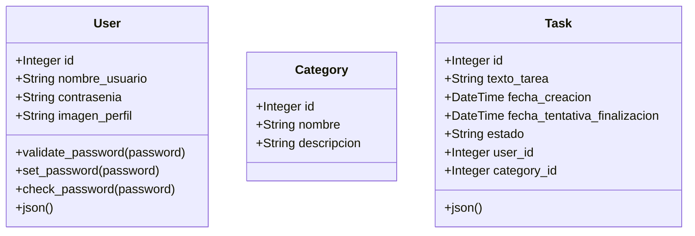

# Entrega-0

## Descripción del Proyecto

Este proyecto consiste en una aplicación web para la gestión de listas de tareas. La aplicación permite a los usuarios crear, organizar y monitorear el progreso de sus actividades diarias. La solución está compuesta por tres componentes principales:

- **API REST**: Implementa la lógica del negocio, proporcionando los endpoints necesarios para la gestión de usuarios, tareas y categorías.
- **Base de datos**: Almacena de manera estructurada la información relacionada con los usuarios y sus tareas.
- **Interfaz web**: Ofrece a los usuarios una experiencia interactiva e intuitiva para administrar sus tareas y categorías, integrándose con los otros componentes.

## Funcionalidades

### Autenticación de Usuarios

- Creación de cuenta con usuario y contraseña.
- Posibilidad de cargar una imagen de perfil.
- Si el usuario no carga una foto, el sistema coloca un icono por defecto.
- Inicio de sesión y cierre de sesión.

### Gestión de Listas y Tareas

- Captura de texto que representa una tarea.
- Organización de tareas en categorías (por ejemplo, Hogar, Trabajo, Urgente, entre otras).
- Creación y eliminación de categorías.

### Estados y Fechas

- Asignación de cada tarea a al menos un estado: Sin Empezar, Empezada, Finalizada.
- Actualización de estados por parte del usuario.
- Registro de la fecha de creación de la tarea para futura trazabilidad y analítica.

### Operaciones sobre Tareas

- Creación de tareas por parte del usuario.
- Eliminación de tareas por parte del usuario.

## API REST

La API REST de la aplicación de gestión de tareas cubre las funcionalidades básicas requeridas. Los endpoints disponibles son:

### Usuarios

- Crear Usuario (POST /usuarios)
- Iniciar Sesión (POST /usuarios/iniciar-sesion)
- Cerrar Sesión (POST /usuarios/logout)

### Tareas

- Obtener Lista de Tareas por Usuario (GET /usuarios/{id}/tareas)
- Crear Tarea (POST /tareas)
- Actualizar Tarea (PUT /tareas/{id})
- Eliminar Tarea (DELETE /tareas/{id})
- Obtener Tarea por ID (GET /tareas/{id})

### Categorías

- Crear Categoría (POST /categorias)
- Eliminar Categoría (DELETE /categorias/{id})
- Obtener Lista de Categorías (GET /categorias)
- Actualizar Categoría (PUT /categorias/{id})

### Autorización y Seguridad

- Se exige un token de autenticación (obtenido en /usuarios/iniciar-sesion) para los endpoints sensibles (crear/actualizar/eliminar tareas, crear/eliminar categorías, etc.).

## Estructura del Proyecto

El proyecto se divide en dos grandes carpetas:

1. **frontend/**: Contiene la aplicación React con sus componentes, servicios y estilos.
2. **backend/**: Alberga la API REST, con toda la lógica de negocio, modelos y rutas de Flask (o tecnología equivalente).

Cada carpeta cuenta con su respectiva configuración para instalación de dependencias, así como archivos de configuración para servicios como Docker o Vite (en el caso de React).

## Tecnologías Utilizadas

- **React**  
  Framework JavaScript para la construcción de interfaces de usuario. Permite la creación de componentes reutilizables y maneja la lógica de la vista de manera eficiente.
- **Axios**  
  Biblioteca para realizar peticiones HTTP desde el frontend. Facilita la comunicación con la API, incluyendo el manejo de tokens de autenticación.

- **Flask**  
  Microframework de Python para construir la API REST. Proporciona herramientas para definir rutas y gestionar solicitudes HTTP.

- **SQLAlchemy**  
  ORM para interactuar con la base de datos. Simplifica las operaciones de creación, lectura, actualización y eliminación de registros.

- **JWT**  
  JSON Web Tokens para la autenticación y autorización en la API, asegurando que cada petición sensible cuente con un token válido.

## Despliegue

- **Docker**  
  El proyecto se encapsula en contenedores para su fácil distribución. Un contenedor para el backend (con las dependencias de Flask y SQLAlchemy) y otro para el frontend (con la configuración de Vite).

- **Producción**  
  Se generan imágenes Docker separadas para frontend y backend. Luego, se ejecutan con Docker Compose o en la plataforma de su elección, exponiendo puertos y conectando servicios de manera segura.

Este esquema de microservicios asegura que la aplicación sea escalable y permita actualizaciones independientes de cada componente.

## FrontEnd

### Estructura del Proyecto

El directorio `frontend` tiene la siguiente estructura:

### Estructura del Proyecto

El directorio `frontend` organiza la base del proyecto React con archivos y carpetas para componentes, servicios y estilos. Cada sección cumple un rol definido, permitiendo separar la lógica (servicios), la presentación (componentes, estilos) y el flujo de navegación (rutas).

### `src/App.jsx`

Gestiona la navegación usando `react-router-dom`. Establece rutas públicas (inicio de sesión, registro, página de inicio) y rutas privadas que requieren token de autenticación. De esta forma, evita que el usuario acceda a secciones sin credenciales válidas.

### `src/main.jsx`

Se encarga de montar la aplicación en el DOM. Inicializa la configuración global (por ejemplo, `<ToastContainer>` para notificaciones) y envuelve la app en proveedores como `LocalizationProvider` para compatibilidad con pickers de fechas.

### `src/components/Auth/Login.jsx`

Renderiza un formulario de inicio de sesión y maneja el proceso de autenticación: envía las credenciales al backend, valida la respuesta y, en caso de éxito, guarda el token en `localStorage`. Si falla, muestra un mensaje de error al usuario.

### `src/components/Auth/Register.jsx`

Ofrece un formulario de registro. Verifica campos como la confirmación de contraseña y, si todo es válido, crea una nueva cuenta en el backend. Permite añadir una imagen de perfil o usar una por defecto. Al terminar, redirige a la pantalla de inicio de sesión.

### `src/components/Categories/CategoryForm.jsx`

Proporciona un formulario sencillo para crear categorías y manejar datos del usuario (vía props). Invoca los métodos del servicio correspondiente y, tras la creación exitosa, notifica o actualiza el estado en la vista que lo integra.

### `src/components/Tasks/TaskForm.jsx`

Permite crear tareas con datos como texto, categoría y fecha límite. Valida la información antes de enviarla al backend y actualiza la lista de tareas o notifica al usuario luego de la respuesta.

### `src/components/Tasks/TaskList.jsx`

Recibe la lista de tareas y las muestra agrupando información (texto, estado, fechas). Facilita el cambio de estado con un menú desplegable y el borrado de tareas con un botón. Cada acción se comunica con el backend para mantener la persistencia.

### `src/services/api.js`

Configura Axios para unificar las solicitudes HTTP al backend. Incluye interceptores que añaden el token JWT a cada petición y capturan errores 401, forzando el cierre de sesión si el token es inválido. Esto centraliza la autenticación y manejo de errores.

### `src/services/categoryService.js`

Define métodos concretos para crear y obtener categorías llamando a los endpoints del backend. Por ejemplo, `createCategory` envía un objeto con la información de la categoría, y `getUserCategories` recupera todas las categorías de un usuario.

### `src/services/taskService.js`

Ofrece métodos similares, pero enfocados en tareas (crear, obtener, actualizar, eliminar). Cada función se comunica con la API ajustando los parámetros y la ruta según el tipo de operación.

### `src/styles/`

Reúne archivos CSS para cada componente, vista o sección. Esto aísla los estilos de cada parte de la app, manteniendo el diseño coherente. Incluye animaciones, fondos e interfaces responsivas, favoreciendo la legibilidad del código y el mantenimiento.

## Backend

### Estructura del Proyecto

El directorio `backend` tiene la siguiente estructura:

### Descripción de Archivos

#### `app.py`

Este archivo contiene la configuración de la aplicación Flask, los modelos de base de datos y las rutas para los endpoints de la API REST.

- **Configuración de la Aplicación**: Configura la aplicación Flask, CORS, SQLAlchemy y JWT.
- **Modelos de Base de Datos**: Define los modelos `User`, `Category` y `Task`.
- **Rutas/CRUD**: Define las rutas para crear, leer, actualizar y eliminar usuarios, tareas y categorías.

#### `flask.dockerfile`

Este archivo define la configuración para construir una imagen Docker de la aplicación Flask.

- **Base Image**: Utiliza `python:3.6-slim-buster`.
- **Working Directory**: Establece `/app` como el directorio de trabajo.
- **Dependencies**: Copia `requirements.txt` y ejecuta `pip install`.
- **Copy Application**: Copia el contenido del directorio actual al contenedor.
- **Expose Port**: Expone el puerto `4000`.
- **Command**: Ejecuta el comando `flask run --host=0.0.0.0 --port=4000`.

#### `requirements.txt`

Este archivo lista las dependencias necesarias para la aplicación Flask.

- **Flask**: Framework web.
- **psycopg2-binary**: Adaptador de base de datos PostgreSQL.
- **Flask-SQLAlchemy**: ORM para bases de datos.
- **Flask-CORS**: Soporte para Cross-Origin Resource Sharing.
- **marshmallow**: Biblioteca de validación y serialización.
- **werkzeug**: Utilidades para hashing de contraseñas.
- **flask_jwt_extended**: Soporte para JSON Web Tokens.

### Documentación de Modelos de Base de Datos

- Plan de Modelado
- Documentación del modelo Usuario
- Documentación del modelo Categoría
- Documentación del modelo Tarea
- Mostrar relaciones entre modelos
- Incluir esquema SQL
- Estructura de Modelos



## Cómo Ejecutar el Proyecto

1. **Clonar el Repositorio**  
   Clona el repositorio en tu máquina local.

2. **Configurar Backend**

   - Dirígete a la carpeta `backend/`.
   - Crea y activa un entorno virtual (opcional, pero recomendado).
   - Instala las dependencias:
     ```bash
     pip install -r requirements.txt
     ```
   - Inicia la aplicación Flask (si se hace de manera local):
     ```bash
     flask run
     ```

3. **Configurar Frontend**

   - En una nueva terminal, ve a la carpeta [frontend](http://_vscodecontentref_/0).
   - Instala las dependencias:
     ```bash
     npm install
     ```
   - Inicia la aplicación React:
     ```bash
     npm run dev
     ```

4. **Uso de Docker** (opcional)
   - En la raíz del proyecto, ejecuta:
     ```bash
     docker-compose up --build
     ```
   - Asegúrate de que los contenedores de frontend y backend se inicien sin errores.

Una vez realizados estos pasos, podrás acceder al frontend en el navegador (por defecto http://localhost:5173 o el puerto configurado) y el backend responderá desde http://localhost:5000 (o tu configuración asignada).

# Sección de la carpeta de pruebas y documentación

Aquí puedes documentar las pruebas y sus resultados:

- Explica el flujo de los test.
- Describe cómo se validan las respuestas.
- Incluye pasos para ejecutar las pruebas.
