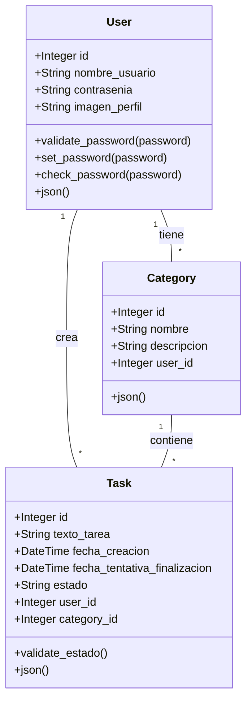

# Entrega-0

## Descripción del Proyecto

Este proyecto consiste en una aplicación web para la gestión de listas de tareas. La aplicación permite a los usuarios crear, organizar y monitorear el progreso de sus actividades diarias. La solución está compuesta por tres componentes principales:

- **API REST**: Implementa la lógica del negocio, proporcionando los endpoints necesarios para la gestión de usuarios, tareas y categorías.
- **Base de datos**: Almacena de manera estructurada la información relacionada con los usuarios y sus tareas.
- **Interfaz web**: Ofrece a los usuarios una experiencia interactiva e intuitiva para administrar sus tareas y categorías, integrándose con los otros componentes.

## Funcionalidades

### Autenticación de Usuarios

- Creación de cuenta con usuario y contraseña.
- Posibilidad de cargar una imagen de perfil (URL).
- Si el usuario no carga una foto, el sistema coloca un icono por defecto.
- Inicio de sesión y cierre de sesión.

### Gestión de Listas y Tareas

- Organización de tareas en categorías (por ejemplo, Hogar, Trabajo, Urgente, entre otras).
- Creación y eliminación de categorías propias del usuario.

### Estados y Fechas

- Asignación de cada tarea a al menos un estado: Sin Empezar, Empezada, Finalizada.
- Actualización de estados por parte del usuario.
- Registro de la fecha de creación de la tarea para trazabilidad y analítica.

### Operaciones sobre Tareas

- Creación de tareas por parte del usuario.
- Eliminación de tareas por parte del usuario.

## API REST

La API REST de la aplicación de gestión de tareas cubre las funcionalidades básicas requeridas. Los endpoints disponibles son:

### Usuarios

- Crear Usuario (POST /usuarios)
- Iniciar Sesión (POST /usuarios/iniciar-sesion)
- Cerrar Sesión (POST /usuarios/logout)

### Tareas

- Obtener Lista de Tareas por Usuario (GET /usuarios/{id}/tareas)
- Crear Tarea de un Usuario (POST /tareas)
- Actualizar Tarea de un Usuario (PUT /tareas/{id})
- Eliminar Tarea de un Usuario (DELETE /tareas/{id})
- Obtener Tarea por ID de un Usuario (GET /tareas/{id})

### Categorías

- Crear Categoría de un Usuario (POST categorias)
- Eliminar Categoría de un Usuario (DELETE /categorias/{id})
- Obtener Lista de Categorías de un Usuario (GET /usuarios/{id}/categorias)
- Actualizar Categoría de un Usuario (PUT /categorias/{id})

### Autorización y Seguridad

- Se exige un token de autenticación (obtenido en /usuarios/iniciar-sesion) para los endpoints sensibles (crear/actualizar/eliminar tareas, crear/eliminar categorías, etc.).

## Estructura del Proyecto

El proyecto se divide en dos grandes carpetas:

1. **frontend/**: Contiene la aplicación React con sus componentes, servicios y estilos.
2. **backend/**: Alberga la API REST, con toda la lógica de negocio, modelos y rutas de Flask.
3. **db**: Alberga la base de datos en PostgresSQL

Cada carpeta cuenta con su respectiva configuración para instalación de dependencias, así como archivos de configuración para servicios como Docker o Vite (en el caso de React).

## Tecnologías Utilizadas

- **React**  
  Framework JavaScript para la construcción de interfaces de usuario. Permite la creación de componentes reutilizables y maneja la lógica de la vista de manera eficiente.
- **Axios**  
  Biblioteca para realizar peticiones HTTP desde el frontend. Facilita la comunicación con la API, incluyendo el manejo de tokens de autenticación.
- **Flask**  
  Microframework de Python para construir la API REST. Proporciona herramientas para definir rutas y gestionar solicitudes HTTP.
- **SQLAlchemy**  
  ORM para interactuar con la base de datos. Simplifica las operaciones de creación, lectura, actualización y eliminación de registros.
- **JWT**  
  JSON Web Tokens para la autenticación y autorización en la API, asegurando que cada petición sensible cuente con un token válido.

## Despliegue

- **Docker**  
  El proyecto se encapsula en contenedores para su fácil distribución. Un contenedor para el backend (con las dependencias de Flask y SQLAlchemy) y otro para el frontend (con la configuración de Vite).

- **Producción**  
  Se generan imágenes Docker separadas para frontend y backend. Luego, se ejecutan con Docker Compose o en la plataforma de su elección, exponiendo puertos y conectando servicios de manera segura.

Este esquema de microservicios asegura que la aplicación sea escalable y permita actualizaciones independientes de cada componente.

# FrontEnd

### Estructura del Proyecto

El directorio `frontend` implementa una aplicación React moderna, estructurada en componentes, servicios y estilos:

### Componentes Principales

#### `src/App.jsx`

- Gestión de rutas con `react-router-dom`
- Protección de rutas privadas mediante token JWT
- Estructura de navegación responsive

#### `src/main.jsx`

- Inicialización de la aplicación
- Configuración de proveedores globales:
  - `ToastContainer` para notificaciones
  - `LocalizationProvider` para fechas
  - Tema personalizado de Material-UI

### Módulos de Autenticación

#### `src/components/Auth/Login.jsx`

- Formulario de inicio de sesión con Material-UI
- Validación de credenciales
- Gestión de token JWT en localStorage
- Manejo de errores y feedback visual
- Redirección post-login

#### `src/components/Auth/Register.jsx`

- Registro de usuarios con validación
- Gestión de imagen de perfil (URL o default)
- Confirmación de contraseña
- Feedback visual con Material-UI Alert
- Animaciones de transición

### Gestión de Datos

#### `src/components/Categories/CategoryForm.jsx`

- Creación de categorías con validación
- Integración con categoryService
- Efectos glassmorphism en UI
- Formulario compacto y completo

#### `src/components/Tasks/TaskForm.jsx`

- Creación de tareas con múltiples campos
- Selector de categorías dinámico
- DatePicker para fechas límite
- Validación de campos requeridos

#### `src/components/Tasks/TaskList.jsx`

- Visualización de tareas con estados
- Cambio de estado mediante Select
- Eliminación de tareas
- Colores dinámicos según estado
- Animaciones en hover

### Servicios API

#### `src/services/api.js`

- Cliente Axios configurado
- Interceptores para:
  - Tokens JWT
  - Errores de autenticación
  - Respuestas globales

#### `src/services/categoryService.js`

- CRUD de categorías
- Métodos:
  - createCategory
  - getUserCategories
  - deleteCategory

#### `src/services/taskService.js`

- CRUD completo de tareas
- Gestión de estados
- Métodos para filtrado y ordenamiento

### Estilos y UX

#### `src/styles/`

Estilos modulares con características:

- Efectos glassmorphism
- Animaciones de entrada/salida
- Diseño responsivo
- Temas consistentes
- Hover effects
- Fondos dinámicos

### Configuración Docker

- Imagen base: `node:18-alpine`
- Optimización de capas
- Servidor de producción con `serve`
- Exposición del puerto 3000

# Backend

## Estructura del Proyecto

El directorio `backend` contiene la implementación del servidor REST API:

## Descripción de Archivos

### `app.py`

Archivo principal que contiene la implementación del servidor:

#### Configuración

- **Flask**: Configuración base de la aplicación web
- **CORS**: Permite peticiones desde `http://localhost:3000`
- **SQLAlchemy**: Configuración de la base de datos
- **JWT**: Autenticación con tokens, expiración 1 hora

#### Modelos de Base de Datos

##### Usuario (`User`)

- **Atributos**:
  - `id`: Integer (PK)
  - `nombre_usuario`: String(80), único
  - `contrasenia`: String(120), hasheada
  - `imagen_perfil`: String(1000), opcional
- **Métodos**:
  - `validate_password()`: Valida requisitos de contraseña
  - `set_password()`: Hashea y guarda contraseña
  - `check_password()`: Verifica contraseña
  - `json()`: Serializa datos del usuario

##### Categoría (`Category`)

- **Atributos**:
  - `id`: Integer (PK)
  - `nombre`: String(80)
  - `descripcion`: String(250), opcional
  - `user_id`: Integer (FK -> User)
- **Métodos**:
  - `json()`: Serializa datos de la categoría

##### Tarea (`Task`)

- **Atributos**:
  - `id`: Integer (PK)
  - `texto_tarea`: String(250)
  - `fecha_creacion`: DateTime, automática
  - `fecha_tentativa_finalizacion`: DateTime, opcional
  - `estado`: String(20), valores: ['PENDIENTE', 'EN_PROGRESO', 'FINALIZADA']
  - `user_id`: Integer (FK -> User)
  - `category_id`: Integer (FK -> Category)
- **Métodos**:
  - `validate_estado()`: Valida estado de la tarea
  - `json()`: Serializa datos de la tarea

#### Endpoints API

##### Usuarios

- `POST /usuarios`: Crear usuario nuevo
- `POST /usuarios/login`: Iniciar sesión
- `POST /usuarios/logout`: Cerrar sesión
- `GET /usuarios`: Listar usuarios
- `GET /usuarios/<id>`: Obtener usuario
- `PUT /usuarios/<id>`: Actualizar usuario
- `DELETE /usuarios/<id>`: Eliminar usuario

##### Categorías

- `POST /categorias`: Crear categoría
- `GET /categorias`: Listar categorías
- `GET /categorias/<id>`: Obtener categoría
- `GET /usuario/<user_id>/categorias`: Categorías por usuario
- `PUT /categorias/<id>`: Actualizar categoría
- `DELETE /categorias/<id>`: Eliminar categoría

##### Tareas

- `POST /tareas`: Crear tarea
- `GET /tareas`: Listar tareas
- `GET /tareas/<id>`: Obtener tarea
- `GET /usuario/<user_id>/tareas`: Tareas por usuario
- `PUT /tareas/<id>`: Actualizar tarea
- `DELETE /tareas/<id>`: Eliminar tarea

### `flask.dockerfile`

Configuración para construir la imagen Docker:

- Base: `python:3.6-slim-buster`
- Directorio: `/app`
- Puerto: `4000`
- Comando: `flask run --host=0.0.0.0 --port=4000`

### `requirements.txt`

Dependencias principales:

- Flask y extensiones (SQLAlchemy, CORS, JWT)
- PostgreSQL adapter
- Utilidades (marshmallow, werkzeug)

## Relaciones entre Modelos



## Cómo Ejecutar el Proyecto

1. **Clonar el Repositorio**
   Clona el repositorio en tu máquina local.

2. **Configurar Backend**

   - Dirígete a la carpeta `backend/`.
   - Crea y activa un entorno virtual (opcional, pero recomendado).
   - Instala las dependencias:
     ```bash
     pip install -r requirements.txt
     ```
   - Inicia la aplicación Flask (si se hace de manera local):
     ```bash
     flask run
     ```

3. **Configurar Frontend**

   - En una nueva terminal, ve a la carpeta [frontend](http://_vscodecontentref_/0).
   - Instala las dependencias:
     ```bash
     npm install
     ```
   - Inicia la aplicación React:
     ```bash
     npm run dev
     ```

4. **Uso de Docker** (opcional)
   - En la raíz del proyecto, ejecuta:
     ```bash
     docker-compose up --build
     ```
   - Asegúrate de que los contenedores de frontend y backend se inicien sin errores.

Una vez realizados estos pasos, podrás acceder al frontend en el navegador (por defecto http://localhost:3000) y el backend responderá desde http://localhost:4000.
